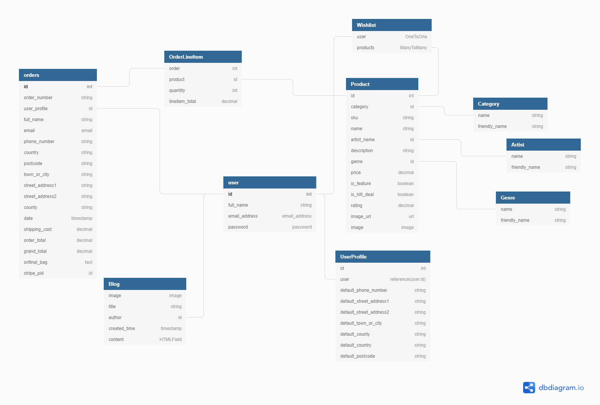

# Press Records

Press Records is an ecommerce store delivering a wide variety of vinyl records, speakers and turntables to music enthusiasts around the globe

You can find a live link to the site [HERE](https://press-records.herokuapp.com/)
## Table of Contents:

- [UX](#ux)
  - [Business Objectives(#business-objectives)]
  - [User Stories](#user-stories)
  - [Strategy](#strategy)
  - [Scope](#scope)
  - [Structure](#structure)
  - [Skeleton](#skeleton)
  - [Surface](#surface)
- [Database Structure](#database-structure)
- [Features](#features)
  - [Deployed Features](#deployed-features)
  - [Features to consider implementing in the future](#features-to-consider-implementing-in-the-future)
- [Technologies Used](#technologies-used)
  - [Languages](#languages)
  - [Frameworks and Tools](#frameworks-and-tools)
  - [Workspace and Related Tools](#workspace-and-related-tools)
- [Resources](#resources)
- [Code Validation Tools](#code-validation-tools)
- [Testing](#testing)
- [Deployment](#deployment)
- [Acknowledgments](#acknowledgments)

## UX

### Business Objectives
- The main objective of the Press Records site is to provide users a place to purchase high quality vinyls and HI-FI products.
- Press Records aims to add new products daily to the store in order to attract and satisfy customers
- The layout and design of the site is such that users can easily purchase products and won't be distracted by unnecessary content.
- The owners would also like a place to share their reviews of records, which is why a blog has been incorporated

### User Stories

### Viewing and Navigation:
|  | As a... | I want to be able to... | So that I can... |
|----|:--------|:------------------------|:-----------------|
1| Shopper| View a list of products available | Browse and select items to purchase |
2| Shopper | View individual product details | View specific product information |
3| Shopper | Easily see featured items and promotions | Make sure not to miss out on deals |
4| Shopper | Save products for purchase later | Add products to a wishlist for future purchasing |

### Registration and User Accounts
| User No. | As a... | I want to be able to... | So that I can... |
|----|:--------|:------------------------|:-----------------|
5| Site User | Easily register for an account | Have personal account that saves my information |
6| Site User | Easily Login or Logout | Access my account with standard login |
7| Site User | Verify my account has been successfully created | Receive an email confirming account linked |
8| Site User | Have a personalized user account | View my order history, personal information and wishlist |

### Registered User Extra Functionality
| User No. | As a... | I want to be able to... | So that I can... |
|----|:--------|:------------------------|:-----------------|

9| Registered User | Add products to my wishlist | Somewhere i can save products i am interested in purchasing at a later date |
10| Registered User | Transfer items from my wishlist to my shopping bag | Easy add to bag button from wishlist |
11| Registered User | Remove items from my wishlist | Delete item if i no longer want or have aquired elsewhere |

### Sorting and Searching
| User No. | As a... | I want to be able to... | So that I can... |
|----|:--------|:------------------------|:-----------------|
12| Shopper | Sort/filter the list of available products | Find the products I want, by name or price|
13| Shopper | Have seperation on product types | Only see certain product types on particular pages |
14| Shopper | Search for a product by name or artist | Find a specific product I'd like to purchase |

### Purchasing and Checkout
| User No. | As a... | I want to be able to... | So that I can... |
|----|:--------|:------------------------|:-----------------|
15| Shopper | Ability to update quantities in the shopping bag | Allow to add additional quantites of items or remove some |
16| Shopper | Clearly see an order summary before checkout | Finl check on items and prices |
17| Shopper | Easily enter my shipping and payment information | Seemless checkout experience |
18| Shopper | See order confirmation post purchase | Verify that the purchase was a success |
19| Shopper | Receive email confirmation | Double verification that the order was a success |

### Store Owner or Product Manager
| User No. | As a... | I want to be able to... | So that I can... |
|----|:--------|:------------------------|:-----------------|
20| Store Owner | Add a product | Add new products to my store |
21| Store Owner | Edit and update a product | Easily change all product information |
22| Store Owner | Delete a product | Remove items if no longer an option |
23| Store Owner | Add a blog post | Add blog posts about items we sell |
24| Store Owner | Edit and update a blog post | Easily change all blog information |
25| Store Owner | Delete a blog | delete a blog if it is no longer relevant |

### Strategy
- Provide a platform where users can find new music in vinyl form
- Provide a platform where users can purchase new vinyls
- Provide a platform where users can purchase HI-FI systems for playing vinyls
- Provide a blog space for curated record reviews for products purchasable on the same store

### Scope 
- An easy to navigate site with simple register, login and logout functions
- A smooth checkout experience utilisinh Stripe
- A wishlist so users can come back to products they are interested in

### Structure
I wanted to create a simple and distraction free platform where the user experience and attention is always kept and directed towards the products being sold. 
For this reason the functionality is limited to only essential functions.
The structure and layout of pages is very similar across the board and allows for easy navigation without distraction

### Skeleton
- [Wireframes](readme-docs/wireframes/wireframes.pdf) - The final commit has not differed much from the initial intentions highlighted in the wireframes
- Navigation Bar
- - My Account - Gives non logged in users the ability to login or register. Gives logged in users access to their account and to logout. Gives store admins the access to add products and blogs
- - Shopping Bag - Takes users to their shopping bags
- Side Bar Navigation
- - Search functionality to search product names and artist names
- - Home - Takes user to the home page
- - Shop - Dropdown with product category links
- - Blog - My Account - Takes user to their account
- - Contact Us - Takes user to contact us page
- - Social Media Links - Directs users to Press Records social media sites

### Surface
The intention for the design was to keep everything simple and not take away from the content.
#### Colours
The colours used through out the site come from the palet below. I wanted to pick one theme colour and runs with complementary colours to keep things simple and elegent

#### Fonts
I used the Roberto font with 300 weighting and sans-serif as backup

## Database Structure
### Models

- Profile/Users
- - User - User information from Allauth including username, name, email address, password
- - Profile - Contains the users information for orders and addresses etc
 
- Products
- - Category - Model containing categories
- - Product - Contains all relevant information for a product
- - Genre - Model to signify genre of a record
- - Artist - This model holds all artists whos vinyls Press Records sells.
- Wishlist
- - Wishlist - This model stores information on what products are in users wishlists
- Orders
- - Order - Model to contain all order information from products to price and shipping addresses
- - OrderLineItem - Each product creates an orderlineitem in the bag
- Blog
- - Blog - Contains all information for each blog post

## Features
### Deployed Features
- Collapsable navigation bar from Bootstrap
- Call to actions to Shop Now on the home page
- Featured products on the home page
- HI-FI Deals on the home page
- Shop by category options
- View all records by a particular artist
- Search product and artist name functionality
- Add, edit and delete functionality for the store admin on products and blogs
- Register, Login and Logout functionality
- Full purchasing functionality through Stripe
- A Wishlist for saving products to your account
- Ability to save shipping details in user account
- Ability to view past orders

### Features to consider implementing in the future
- Review section on products
- I have set up a Genre model and genres are recorded for all vinyls. In the future i wouls like to set up functionality to be able to view all vinyls from a particular genre
- Integrate a WYSIWYG editor directly into the blog management to not have to direct an author towards the django admin for blog post entries

## Technologies Used

### Languages
- [HTML5](https://en.wikipedia.org/wiki/HTML5)
- [CSS](https://en.wikipedia.org/wiki/CSS)
- [JavaScript](https://en.wikipedia.org/wiki/JavaScript)
- [Python](<https://en.wikipedia.org/wiki/Python_(programming_language)>)

### Frameworks and Tools

- [FontAwesome](https://fontawesome.com/) - Used for icons
- [MDBootstrap](https://mdbootstrap.com/) - CSS framework
- [jQuery](https://jquery.com/) - JavaScript library.
- [Django](https://en.wikipedia.org/wiki/Django_(web_framework) - Python framework for building web applications
- [MongoDB](https://www.mongodb.com/) - NoSQL database program, using JSON-like documents.
- [ImageKit](https://imagekit.io/) - Used to host images for display on site
- - ImageKit enables automatic optimisation and real time transformation to resize images depending on the screen size in use

### Workspace and Related Tools
- [Gitpod](https://www.gitpod.io/) - Integrated Development Environment used to write the code
- [GitHub](https://github.com/) - Repository hosting service
- [Git](https://git-scm.com/) - Version control tool to manage any changes and allow to revert to previous version
- [Heroku](https://www.heroku.com/) - Cloud based platform for hosting web applications feeding straight from the GitHub repository

## Resources
- [Stack Overflow](https://stackoverflow.com/) - Educational resource
- [Youtube](https://www.youtube.com/) - Tutorial resource
- [Balsamiq](https://balsamiq.com/wireframes/) - Used to generate Wireframes
- [W3Schools](https://www.w3schools.com/js/default.asp) - Used to check up on methods etc.
- [Quick DBD](https://www.quickdatabasediagrams.com/) - Database diagram visualisation tool
- [Coolors](https://coolors.co/) - Help find suitable complimentary colours for the site

## Code Validation Tools
- [WC3 HTML Validator](https://validator.w3.org/) - Used to test HTML code
- [WC3 CSS Validator](https://jigsaw.w3.org/css-validator/) - Used to test CSS code
- [JS Hint](https://jshint.com/) - Used to test JavaScript
- [PEP8 online](http://pep8online.com/) - Used to test Python code was written to PEP8 standards

## Deployment
### Heroku Deployment
This project is hosted on Heroku. I deployed the Django app to Heroku after i had the majority of the basic functionality set up and working locally

- Login to Heroku and press 'New' in the top right corner, then press 'Create New App'
- Next I entered the name of the project and the nearest region to me
- Next I navigated to 'Settings' and then 'Config Vars'. From here I proceeded to add the configuration variables that I had set up in my gitpod environment and then variables related to AWS and emails.
- After this I navigated to the Deploy section.
- Next I connected my GitHub repository for the project under 'Deployment Method'.
- Finally, I selected the main branch and clicked 'Deploy Branch', ensuring Automatic Deployments were enables

